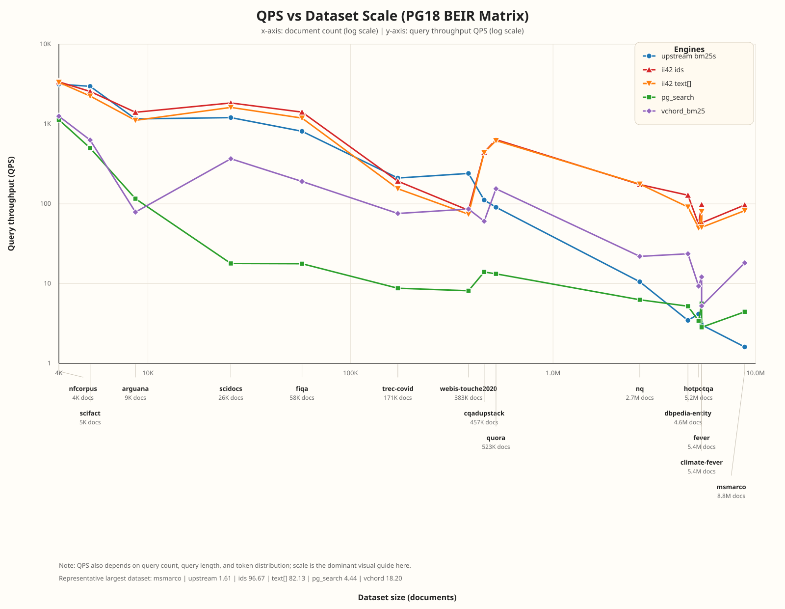
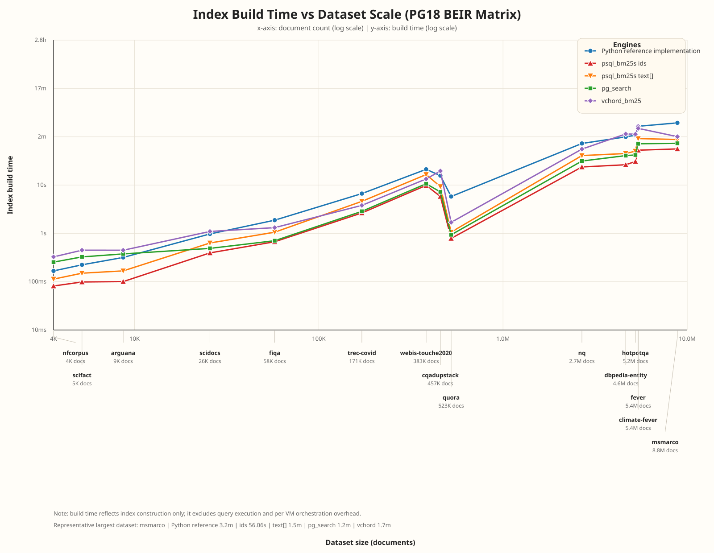
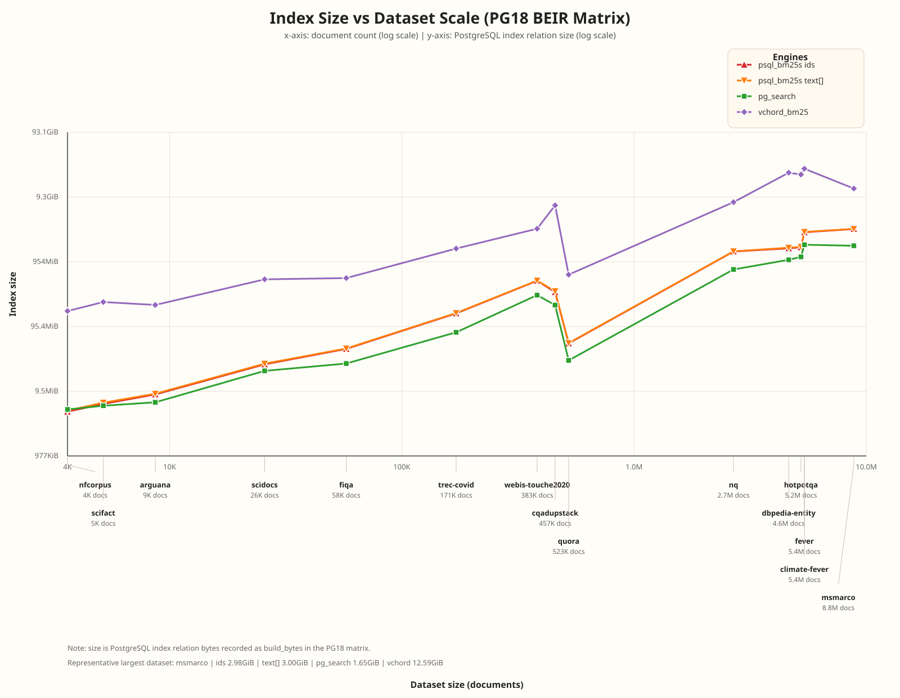
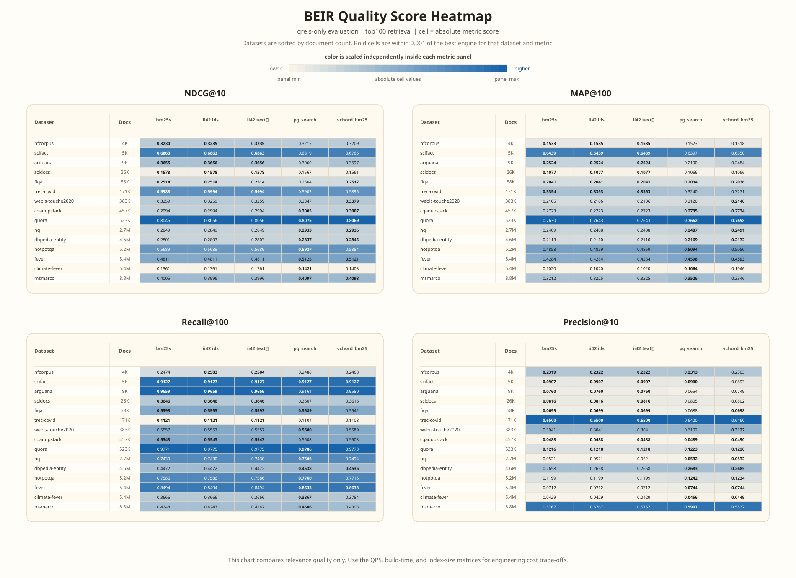

# Performance and Benchmarks

This page is the default performance entry point for `psql_bm25s`.

Date: 2026-04-02

The current project reference is the latest PG18 `15 x 5` BEIR matrix:

- Python reference implementation `bm25s`
- `psql_bm25s ids`
- `psql_bm25s text[]`
- ParadeDB `pg_search`
- TensorChord `vchord_bm25`

Third-party project names identify the measured engines for
reproducibility. The numbers on this page depend on the measured
versions, configuration, hardware, workload, and query settings; they
are not universal claims about any project outside this benchmark scope.

The exact BM25 PostgreSQL APIs remain the main anchor for
`psql_bm25s` performance claims:

- `psql_bm25s_query_ids(...)`
- `psql_bm25s_query_tokens(...)`

The published matrix on this page is intentionally based on the
pretokenized index paths:

- `psql_bm25s ids` uses `int4[]`
- `psql_bm25s text[]` uses `text[]`

Scalar `text` and `varchar` source columns are supported in the
extension, but they are not the basis of the public `2026-04-02`
cross-engine matrix. See [Supported Input Types](../input-types.md) for
the type-by-type contract and trade-offs.

Raw data used by this page:

- `official-beir-ids-current-2026-04-02.json`
- `official-beir-text-current-2026-04-02.json`
- `official-beir-python-reference-current-2026-04-02.json`
- `official-beir-pg18-comparison-current-2026-04-02.json`
- `pg18-beir-extension-matrix-current-2026-04-02.json`
- `pg18-beir-quality-matrix-current-2026-05-06.json`

Raw per-dataset result cells:

- `data/raw/pg18-beir-current-matrix-2026-04-02/results/<dataset>/<engine>.json`

Validation status:

- `75/75` dataset-engine cells in the rolled-up current matrix were
  checked against the backing raw cells
- `30/75` refreshed `psql_bm25s` cells come from the
  `2026-04-02` Google Cloud refresh run
- `45/75` carried-forward Python reference / `pg_search` / `vchord_bm25` cells
  remain pinned to the stable `2026-03-31` PG18 matrix
- the current matrix and the raw cells match exactly on:
  - `stats`
  - `build_ms`
  - `query.count`
  - `query.qps`

## How To Read This Section

This page is intentionally limited to the current public PG18 matrix and
the raw data needed to verify it. No other benchmark artifacts are part
of this public performance reference.

## Scope

The current public read-performance report is based on two aligned GCP
PG18 runs:

- the stable `2026-03-31` full `15 x 5` matrix
- the `2026-04-02` refresh run that updated only
  `psql_bm25s ids` and `psql_bm25s text[]`
- all 15 official BEIR subsets used in the BM25S benchmark set
- the uploaded dataset cache
- `top_k = 1000`

Benchmark scope:

- cloud: Google Cloud
- zone: `us-east4-a`
- machine type: `n2-standard-16`
- PostgreSQL: `18`
- dataset delivery: uploaded dataset cache, not runtime download
- Python reference implementation path: Python `bm25s` carried forward
  from the stable `2026-03-31` matrix
- PostgreSQL paths:
  - `psql_bm25s_query_ids(...)` refreshed on `2026-04-02`
  - `psql_bm25s_query_tokens(...)` refreshed on `2026-04-02`
  - ParadeDB `pg_search` carried forward from `2026-03-31`
  - TensorChord `vchord_bm25` carried forward from `2026-03-31`

For `psql_bm25s`, the benchmark configuration matched the latest tuned
exact path:

- `method = 'lucene'`
- `idf_method = 'lucene'`
- `k1 = 1.5`
- `b = 0.75`
- `delta = 0.5`
- `consistency = 'manual'`

## Query Summary

`min`, `median`, and `max` below mean the per-dataset ratio of engine
QPS against the Python reference implementation `bm25s` across the full
15-dataset suite.

| Path | At or above Python reference | Min vs Python reference | Median vs Python reference | Max vs Python reference |
| --- | ---: | ---: | ---: | ---: |
| `psql_bm25s ids` | `12/15` | `0.35x` | `3.97x` | `60.10x` |
| `psql_bm25s text[]` | `11/15` | `0.31x` | `3.93x` | `51.06x` |
| `pg_search` | `3/15` | `0.01x` | `0.17x` | `2.76x` |
| `vchord_bm25` | `7/15` | `0.07x` | `0.54x` | `11.31x` |

## Index Build Summary

`build` here means index construction time only.

| Path | Total build ms | Relative to Python reference |
| --- | ---: | ---: |
| Python reference implementation `bm25s` | `848046.35` | `1.00x` |
| `psql_bm25s ids` | `262955.79` | `0.31x` |
| `psql_bm25s text[]` | `443975.35` | `0.52x` |
| `pg_search` | `356944.25` | `0.42x` |
| `vchord_bm25` | `739014.63` | `0.87x` |

## Dataset Table

| Dataset | Docs | Queries | Python reference implementation `bm25s` QPS | `psql_bm25s ids` QPS | `psql_bm25s text[]` QPS | `pg_search` QPS | `vchord_bm25` QPS |
| --- | ---: | ---: | ---: | ---: | ---: | ---: | ---: |
| `arguana` | 8,674 | 1,406 | 1158.34 | 1402.63 | 1112.01 | 115.94 | 78.77 |
| `climate-fever` | 5,416,593 | 1,535 | 3.04 | 57.78 | 50.75 | 2.84 | 5.25 |
| `cqadupstack` | 457,199 | 13,145 | 111.56 | 443.13 | 438.42 | 13.99 | 60.51 |
| `dbpedia-entity` | 4,635,922 | 467 | 3.47 | 128.19 | 91.19 | 5.21 | 23.66 |
| `fever` | 5,416,568 | 123,142 | 3.15 | 97.56 | 80.15 | 5.62 | 12.13 |
| `fiqa` | 57,638 | 6,648 | 810.51 | 1409.52 | 1186.41 | 17.76 | 190.57 |
| `hotpotqa` | 5,233,329 | 97,852 | 4.16 | 55.40 | 49.86 | 3.42 | 9.31 |
| `msmarco` | 8,841,823 | 509,962 | 1.61 | 96.67 | 82.13 | 4.44 | 18.20 |
| `nfcorpus` | 3,633 | 3,237 | 3155.35 | 3373.94 | 3326.96 | 1132.17 | 1252.75 |
| `nq` | 2,681,468 | 3,452 | 10.55 | 174.34 | 176.69 | 6.28 | 21.96 |
| `quora` | 522,931 | 15,000 | 90.56 | 637.98 | 619.64 | 13.26 | 154.36 |
| `scidocs` | 25,657 | 1,000 | 1203.09 | 1835.85 | 1614.92 | 17.89 | 367.04 |
| `scifact` | 5,183 | 1,109 | 2964.86 | 2557.47 | 2240.18 | 500.04 | 629.42 |
| `trec-covid` | 171,332 | 50 | 210.50 | 191.94 | 154.48 | 8.75 | 75.66 |
| `webis-touche2020` | 382,545 | 49 | 240.36 | 82.97 | 74.10 | 8.14 | 86.04 |

## Scale Trend

## Index Build Matrix

Query throughput is still the headline metric, but build time matters
for every bulk load, refresh, and reproducible end-to-end deployment.
The matrix below reports index construction time only. It excludes query
execution and VM orchestration overhead so the comparison stays focused
on the actual indexing cost of each engine.

The same dataset order is used as the query matrix above. That makes it
easy to compare the two dimensions directly: one table answers "how fast
is query execution after the index exists?" and the second answers "how
expensive is it to get to that state?".

| Dataset | Docs | Queries | Python reference implementation `bm25s` build | `psql_bm25s ids` build | `psql_bm25s text[]` build | `pg_search` build | `vchord_bm25` build |
| --- | ---: | ---: | ---: | ---: | ---: | ---: | ---: |
| `nfcorpus` | 3,633 | 3,237 | 167ms | 82ms | 113ms | 254ms | 326ms |
| `scifact` | 5,183 | 1,109 | 224ms | 99ms | 150ms | 326ms | 449ms |
| `arguana` | 8,674 | 1,406 | 318ms | 101ms | 168ms | 376ms | 448ms |
| `scidocs` | 25,657 | 1,000 | 974ms | 395ms | 633ms | 490ms | 1.10s |
| `fiqa` | 57,638 | 6,648 | 1.88s | 672ms | 1.06s | 705ms | 1.32s |
| `trec-covid` | 171,332 | 50 | 6.67s | 2.65s | 4.61s | 2.86s | 3.80s |
| `webis-touche2020` | 382,545 | 49 | 21.18s | 9.84s | 16.51s | 10.65s | 13.39s |
| `cqadupstack` | 457,199 | 13,145 | 15.68s | 5.83s | 9.29s | 7.21s | 19.56s |
| `quora` | 522,931 | 15,000 | 5.80s | 788ms | 1.06s | 936ms | 1.69s |
| `nq` | 2,681,468 | 3,452 | 1.2m | 23.71s | 40.80s | 31.46s | 55.57s |
| `dbpedia-entity` | 4,635,922 | 467 | 1.7m | 26.37s | 45.05s | 40.73s | 1.9m |
| `hotpotqa` | 5,233,329 | 97,852 | 1.8m | 30.79s | 50.38s | 41.97s | 1.9m |
| `fever` | 5,416,568 | 123,142 | 2.6m | 52.83s | 1.6m | 1.2m | 2.7m |
| `climate-fever` | 5,416,593 | 1,535 | 2.7m | 52.74s | 1.5m | 1.2m | 2.5m |
| `msmarco` | 8,841,823 | 509,962 | 3.2m | 56.06s | 1.5m | 1.2m | 1.7m |

## Build Trend

Build-time trend highlights:

- Total build-time ratios versus Python reference implementation `bm25s` are `0.31x`
  for `psql_bm25s ids`, `0.52x` for `psql_bm25s text[]`, `0.42x` for
  `pg_search`, and `0.87x` for `vchord_bm25`.
- Dataset counts at or below Python reference build time are `15/15` for
  `psql_bm25s ids`, `15/15` for `psql_bm25s text[]`, `12/15` for
  `pg_search`, and `7/15` for `vchord_bm25`.
- The build-time matrix should be read together with query throughput
  and index size, because each path makes a different index-time versus
  query-time trade-off.

## Index Size Matrix

The matrix also records PostgreSQL index relation size as `build_bytes`.
The Python reference implementation `bm25s` path is omitted here because
it is not a PostgreSQL index relation and does not report an equivalent
byte count.

| Dataset | Docs | `psql_bm25s ids` size | `psql_bm25s text[]` size | `pg_search` size | `vchord_bm25` size |
| --- | ---: | ---: | ---: | ---: | ---: |
| `nfcorpus` | 3,633 | 4.60 MiB | 4.80 MiB | 4.98 MiB | 165.37 MiB |
| `scifact` | 5,183 | 6.09 MiB | 6.35 MiB | 5.70 MiB | 227.52 MiB |
| `arguana` | 8,674 | 8.51 MiB | 8.73 MiB | 6.43 MiB | 205.01 MiB |
| `scidocs` | 25,657 | 24.81 MiB | 25.43 MiB | 19.67 MiB | 510.23 MiB |
| `fiqa` | 57,638 | 42.96 MiB | 43.62 MiB | 25.55 MiB | 533.44 MiB |
| `trec-covid` | 171,332 | 151.95 MiB | 153.91 MiB | 77.53 MiB | 1.49 GiB |
| `webis-touche2020` | 382,545 | 484.02 MiB | 488.45 MiB | 290.91 MiB | 3.02 GiB |
| `cqadupstack` | 457,199 | 323.90 MiB | 334.80 MiB | 204.12 MiB | 6.92 GiB |
| `quora` | 522,931 | 52.29 MiB | 52.95 MiB | 28.55 MiB | 602.66 MiB |
| `nq` | 2,681,468 | 1.34 GiB | 1.35 GiB | 725.37 MiB | 7.75 GiB |
| `dbpedia-entity` | 4,635,922 | 1.50 GiB | 1.54 GiB | 1022.44 MiB | 22.13 GiB |
| `hotpotqa` | 5,233,329 | 1.56 GiB | 1.59 GiB | 1.11 GiB | 20.70 GiB |
| `fever` | 5,416,568 | 2.66 GiB | 2.69 GiB | 1.70 GiB | 25.47 GiB |
| `climate-fever` | 5,416,593 | 2.66 GiB | 2.69 GiB | 1.70 GiB | 25.47 GiB |
| `msmarco` | 8,841,823 | 2.98 GiB | 3.00 GiB | 1.65 GiB | 12.59 GiB |

## Index Size Trend

## Quality Matrix

The quality matrix is a local PG18 relevance run over the same 15 BEIR
datasets. It measures `NDCG@10`, `MAP@100`, `Recall@100`, and
`Precision@10` with `top_k = 100`.

This table uses qrels-bearing queries only. That means the evaluated query
count can be smaller than the full query count shown in the QPS table.

The local machine had all five comparison engines available for this
relevance run: Python reference implementation `bm25s`, `psql_bm25s ids`,
`psql_bm25s text[]`, `pg_search`, and `vchord_bm25`.

The primary chart is an absolute-score heatmap rather than a dataset-scale
line chart. Each cell is the metric value for one engine on one dataset.
Bold cells are within `0.001` of the best engine for that dataset and
metric.

| Dataset | Docs | Eval queries | Engine | NDCG@10 | MAP@100 | Recall@100 | Precision@10 |
| --- | ---: | ---: | --- | ---: | ---: | ---: | ---: |
| `nfcorpus` | 3,633 | 323 | Python reference implementation `bm25s` | 0.3230 | 0.1533 | 0.2474 | 0.2319 |
| `nfcorpus` | 3,633 | 323 | `psql_bm25s ids` | 0.3235 | 0.1535 | 0.2503 | 0.2322 |
| `nfcorpus` | 3,633 | 323 | `psql_bm25s text[]` | 0.3235 | 0.1535 | 0.2504 | 0.2322 |
| `nfcorpus` | 3,633 | 323 | `pg_search` | 0.3215 | 0.1523 | 0.2486 | 0.2313 |
| `nfcorpus` | 3,633 | 323 | `vchord_bm25` | 0.3209 | 0.1518 | 0.2468 | 0.2303 |
| `scifact` | 5,183 | 300 | Python reference implementation `bm25s` | 0.6863 | 0.6439 | 0.9127 | 0.0907 |
| `scifact` | 5,183 | 300 | `psql_bm25s ids` | 0.6863 | 0.6439 | 0.9127 | 0.0907 |
| `scifact` | 5,183 | 300 | `psql_bm25s text[]` | 0.6863 | 0.6439 | 0.9127 | 0.0907 |
| `scifact` | 5,183 | 300 | `pg_search` | 0.6819 | 0.6397 | 0.9127 | 0.0900 |
| `scifact` | 5,183 | 300 | `vchord_bm25` | 0.6766 | 0.6350 | 0.9127 | 0.0893 |
| `arguana` | 8,674 | 1,406 | Python reference implementation `bm25s` | 0.3655 | 0.2524 | 0.9659 | 0.0760 |
| `arguana` | 8,674 | 1,406 | `psql_bm25s ids` | 0.3656 | 0.2524 | 0.9659 | 0.0760 |
| `arguana` | 8,674 | 1,406 | `psql_bm25s text[]` | 0.3656 | 0.2524 | 0.9659 | 0.0760 |
| `arguana` | 8,674 | 1,406 | `pg_search` | 0.3060 | 0.2100 | 0.9161 | 0.0654 |
| `arguana` | 8,674 | 1,406 | `vchord_bm25` | 0.3597 | 0.2484 | 0.9580 | 0.0749 |
| `scidocs` | 25,657 | 1,000 | Python reference implementation `bm25s` | 0.1578 | 0.1077 | 0.3646 | 0.0816 |
| `scidocs` | 25,657 | 1,000 | `psql_bm25s ids` | 0.1578 | 0.1077 | 0.3646 | 0.0816 |
| `scidocs` | 25,657 | 1,000 | `psql_bm25s text[]` | 0.1578 | 0.1077 | 0.3646 | 0.0816 |
| `scidocs` | 25,657 | 1,000 | `pg_search` | 0.1567 | 0.1066 | 0.3607 | 0.0805 |
| `scidocs` | 25,657 | 1,000 | `vchord_bm25` | 0.1561 | 0.1066 | 0.3616 | 0.0802 |
| `fiqa` | 57,638 | 648 | Python reference implementation `bm25s` | 0.2514 | 0.2041 | 0.5593 | 0.0699 |
| `fiqa` | 57,638 | 648 | `psql_bm25s ids` | 0.2514 | 0.2041 | 0.5593 | 0.0699 |
| `fiqa` | 57,638 | 648 | `psql_bm25s text[]` | 0.2514 | 0.2041 | 0.5593 | 0.0699 |
| `fiqa` | 57,638 | 648 | `pg_search` | 0.2504 | 0.2034 | 0.5589 | 0.0688 |
| `fiqa` | 57,638 | 648 | `vchord_bm25` | 0.2517 | 0.2036 | 0.5542 | 0.0698 |
| `trec-covid` | 171,332 | 50 | Python reference implementation `bm25s` | 0.5988 | 0.3354 | 0.1121 | 0.6500 |
| `trec-covid` | 171,332 | 50 | `psql_bm25s ids` | 0.5994 | 0.3353 | 0.1121 | 0.6500 |
| `trec-covid` | 171,332 | 50 | `psql_bm25s text[]` | 0.5994 | 0.3353 | 0.1121 | 0.6500 |
| `trec-covid` | 171,332 | 50 | `pg_search` | 0.5903 | 0.3240 | 0.1104 | 0.6420 |
| `trec-covid` | 171,332 | 50 | `vchord_bm25` | 0.5895 | 0.3271 | 0.1108 | 0.6460 |
| `webis-touche2020` | 382,545 | 49 | Python reference implementation `bm25s` | 0.3259 | 0.2105 | 0.5557 | 0.3041 |
| `webis-touche2020` | 382,545 | 49 | `psql_bm25s ids` | 0.3259 | 0.2106 | 0.5557 | 0.3041 |
| `webis-touche2020` | 382,545 | 49 | `psql_bm25s text[]` | 0.3259 | 0.2106 | 0.5557 | 0.3041 |
| `webis-touche2020` | 382,545 | 49 | `pg_search` | 0.3347 | 0.2120 | 0.5600 | 0.3102 |
| `webis-touche2020` | 382,545 | 49 | `vchord_bm25` | 0.3379 | 0.2140 | 0.5589 | 0.3122 |
| `cqadupstack` | 457,199 | 13,145 | Python reference implementation `bm25s` | 0.2994 | 0.2723 | 0.5543 | 0.0488 |
| `cqadupstack` | 457,199 | 13,145 | `psql_bm25s ids` | 0.2994 | 0.2723 | 0.5543 | 0.0488 |
| `cqadupstack` | 457,199 | 13,145 | `psql_bm25s text[]` | 0.2994 | 0.2723 | 0.5543 | 0.0488 |
| `cqadupstack` | 457,199 | 13,145 | `pg_search` | 0.3005 | 0.2735 | 0.5508 | 0.0489 |
| `cqadupstack` | 457,199 | 13,145 | `vchord_bm25` | 0.3007 | 0.2734 | 0.5503 | 0.0490 |
| `quora` | 522,931 | 10,000 | Python reference implementation `bm25s` | 0.8045 | 0.7630 | 0.9771 | 0.1216 |
| `quora` | 522,931 | 10,000 | `psql_bm25s ids` | 0.8056 | 0.7643 | 0.9775 | 0.1218 |
| `quora` | 522,931 | 10,000 | `psql_bm25s text[]` | 0.8056 | 0.7643 | 0.9775 | 0.1218 |
| `quora` | 522,931 | 10,000 | `pg_search` | 0.8075 | 0.7662 | 0.9786 | 0.1223 |
| `quora` | 522,931 | 10,000 | `vchord_bm25` | 0.8069 | 0.7658 | 0.9770 | 0.1220 |
| `nq` | 2,681,468 | 3,452 | Python reference implementation `bm25s` | 0.2849 | 0.2409 | 0.7430 | 0.0521 |
| `nq` | 2,681,468 | 3,452 | `psql_bm25s ids` | 0.2849 | 0.2408 | 0.7430 | 0.0521 |
| `nq` | 2,681,468 | 3,452 | `psql_bm25s text[]` | 0.2849 | 0.2408 | 0.7430 | 0.0521 |
| `nq` | 2,681,468 | 3,452 | `pg_search` | 0.2933 | 0.2487 | 0.7506 | 0.0532 |
| `nq` | 2,681,468 | 3,452 | `vchord_bm25` | 0.2935 | 0.2491 | 0.7494 | 0.0532 |
| `dbpedia-entity` | 4,635,922 | 400 | Python reference implementation `bm25s` | 0.2801 | 0.2113 | 0.4472 | 0.2658 |
| `dbpedia-entity` | 4,635,922 | 400 | `psql_bm25s ids` | 0.2803 | 0.2110 | 0.4472 | 0.2658 |
| `dbpedia-entity` | 4,635,922 | 400 | `psql_bm25s text[]` | 0.2803 | 0.2110 | 0.4472 | 0.2658 |
| `dbpedia-entity` | 4,635,922 | 400 | `pg_search` | 0.2837 | 0.2169 | 0.4538 | 0.2683 |
| `dbpedia-entity` | 4,635,922 | 400 | `vchord_bm25` | 0.2845 | 0.2172 | 0.4536 | 0.2685 |
| `hotpotqa` | 5,233,329 | 7,405 | Python reference implementation `bm25s` | 0.5689 | 0.4858 | 0.7586 | 0.1199 |
| `hotpotqa` | 5,233,329 | 7,405 | `psql_bm25s ids` | 0.5689 | 0.4859 | 0.7586 | 0.1199 |
| `hotpotqa` | 5,233,329 | 7,405 | `psql_bm25s text[]` | 0.5689 | 0.4859 | 0.7586 | 0.1199 |
| `hotpotqa` | 5,233,329 | 7,405 | `pg_search` | 0.5927 | 0.5094 | 0.7760 | 0.1242 |
| `hotpotqa` | 5,233,329 | 7,405 | `vchord_bm25` | 0.5884 | 0.5050 | 0.7716 | 0.1234 |
| `fever` | 5,416,568 | 6,666 | Python reference implementation `bm25s` | 0.4811 | 0.4284 | 0.8494 | 0.0712 |
| `fever` | 5,416,568 | 6,666 | `psql_bm25s ids` | 0.4811 | 0.4284 | 0.8494 | 0.0712 |
| `fever` | 5,416,568 | 6,666 | `psql_bm25s text[]` | 0.4811 | 0.4284 | 0.8494 | 0.0712 |
| `fever` | 5,416,568 | 6,666 | `pg_search` | 0.5125 | 0.4598 | 0.8633 | 0.0744 |
| `fever` | 5,416,568 | 6,666 | `vchord_bm25` | 0.5121 | 0.4593 | 0.8638 | 0.0744 |
| `climate-fever` | 5,416,593 | 1,535 | Python reference implementation `bm25s` | 0.1361 | 0.1020 | 0.3666 | 0.0429 |
| `climate-fever` | 5,416,593 | 1,535 | `psql_bm25s ids` | 0.1361 | 0.1020 | 0.3666 | 0.0429 |
| `climate-fever` | 5,416,593 | 1,535 | `psql_bm25s text[]` | 0.1361 | 0.1020 | 0.3666 | 0.0429 |
| `climate-fever` | 5,416,593 | 1,535 | `pg_search` | 0.1421 | 0.1064 | 0.3867 | 0.0456 |
| `climate-fever` | 5,416,593 | 1,535 | `vchord_bm25` | 0.1403 | 0.1046 | 0.3784 | 0.0449 |
| `msmarco` | 8,841,823 | 43 | Python reference implementation `bm25s` | 0.4005 | 0.3212 | 0.4248 | 0.5767 |
| `msmarco` | 8,841,823 | 43 | `psql_bm25s ids` | 0.3996 | 0.3225 | 0.4247 | 0.5767 |
| `msmarco` | 8,841,823 | 43 | `psql_bm25s text[]` | 0.3996 | 0.3225 | 0.4247 | 0.5767 |
| `msmarco` | 8,841,823 | 43 | `pg_search` | 0.4097 | 0.3526 | 0.4506 | 0.5907 |
| `msmarco` | 8,841,823 | 43 | `vchord_bm25` | 0.4093 | 0.3346 | 0.4393 | 0.5837 |

Quality readout:

- All five engines sit in a close relevance band on this BM25 quality
  matrix. Average `NDCG@10` ranges from `0.3976` to `0.4019` across the
  compared engines.
- `psql_bm25s ids` and `psql_bm25s text[]` remain quality-neutral exact
  PostgreSQL paths in this run. Their largest absolute metric difference
  from the Python reference implementation is below `0.0030`, while their
  engineering cost profile is covered by the QPS, build-time, and
  index-size matrices above.
- `pg_search` and `vchord_bm25` are also competitive on relevance in this
  quality validation run, but they have different throughput and storage trade-
  offs in the main performance matrix.
- These quality metrics do not replace the QPS, build-time, or index-size
  matrix above. They only show that the compared engines are retrieving
  similarly relevant top-100 candidates under the BEIR qrels.

## Readout

- Median QPS ratios versus Python reference implementation `bm25s` are `3.97x` for
  `psql_bm25s ids`, `3.93x` for `psql_bm25s text[]`, `0.54x` for
  `vchord_bm25`, and `0.17x` for `pg_search`.
- Dataset counts at or above Python reference implementation `bm25s` are `12/15` for
  `psql_bm25s ids`, `11/15` for `psql_bm25s text[]`, `7/15` for
  `vchord_bm25`, and `3/15` for `pg_search`.
- On the largest workload, `msmarco`, the measured QPS was `96.67` for
  `psql_bm25s ids`, `82.13` for `psql_bm25s text[]`, `18.20` for
  `vchord_bm25`, `4.44` for `pg_search`, and `1.61` for the Python
  reference implementation `bm25s`.
- Build-time, index-size, and quality matrices should be read alongside
  QPS because the compared paths make different operational trade-offs.

## Practical Conclusion

- The current public reference is the refreshed PG18 `15 x 5` matrix.
- If throughput is the priority today, the recommended path is still
  `int4[]` plus `psql_bm25s_query_ids(...)`.
- `text[]` remains a strong, exact, and practical alternative when the
  token-array path is not desirable.
- The published cross-engine matrix is still anchored to the
  pretokenized `int4[]` and `text[]` paths.
- The current matrix supports this throughput ordering by suite median:
  - `psql_bm25s ids` first
  - `psql_bm25s text[]` second
  - `vchord_bm25` third
  - `pg_search` fourth
- The PG18 matrix is the current public benchmark reference for this
  repository.
